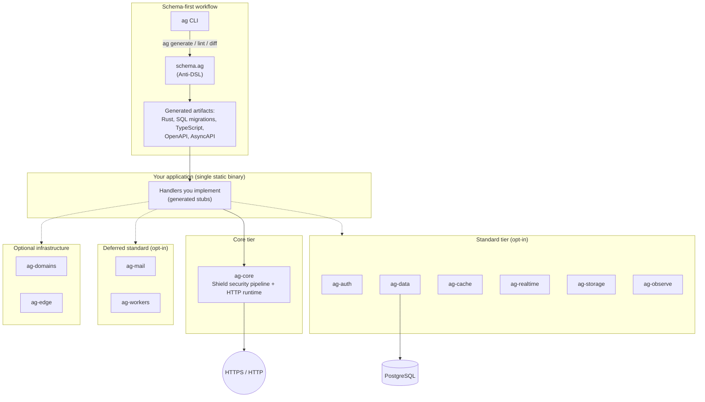

# Anti-Gravital

Rust-native, modular backend framework for building secure, high-performance
services with a schema-first workflow: declare your models, endpoints, auth,
events, mail, domains and workers in a single `.ag` schema, generate the
Rust/SQL/TypeScript/OpenAPI surface, and ship a small static binary.

[](https://github.com/Anti-Gravital/Anti-Gravital/actions/workflows/ci.yml)
[](https://github.com/Anti-Gravital/Anti-Gravital/actions/workflows/quality.yml)
[](LICENSE)
[](rust-toolchain.toml)
[](docs/roadmap/STATUS.md)

[English](#english) | [Espanol](#espanol) — English is the canonical project
language (ADR-0008). A full Spanish version follows the English one.

---

## English

### Table of contents

1. [Project at a glance](#project-at-a-glance)
2. [What is Anti-Gravital](#what-is-anti-gravital)
3. [What you can do today](#what-you-can-do-today)
4. [What you cannot do yet](#what-you-cannot-do-yet)
5. [What Anti-Gravital is not](#what-anti-gravital-is-not)
6. [Quick start](#quick-start)
7. [The Anti-DSL](#the-anti-dsl)
8. [CLI reference](#cli-reference)
9. [Architecture](#architecture)
10. [Repository layout](#repository-layout)
11. [Vision and engineering principles](#vision-and-engineering-principles)
12. [Roadmap and phase model](#roadmap-and-phase-model)
13. [Known limitations and release blockers](#known-limitations-and-release-blockers)
14. [Documentation map](#documentation-map)
15. [Contributing and security](#contributing-and-security)

### Project at a glance

| | |
| --- | --- |
| Language and runtime | Rust (MSRV 1.95.0) on Tokio, Axum, Tower and rustls |
| License | Apache-2.0 |
| Released version | None yet. No crates.io releases, no binary releases; install from source only |
| Workspace | 20 `ag-*` crates plus the `ag` developer CLI (6 of them are reserved placeholders for later phases) |
| Current position | Phases 0-4.5 implemented with their exit gates still open; additive Phase 4.6 in progress |
| Production-ready | No. The formal pre-Phase-5 release gate is OPEN ([release gate](docs/audits/PRE_FASE5_RELEASE_GATE.md)) |
| Live status | [docs/roadmap/STATUS.md](docs/roadmap/STATUS.md), checkbox-level, updated with every roadmap PR |

Status statements in this README were verified on 2026-06-12 against
`docs/roadmap/STATUS.md` (last updated 2026-06-10). "Implemented" means the
code and tests exist in this repository and pass CI; it is never a
production-readiness certification.

### What is Anti-Gravital

Anti-Gravital gives Rust backend teams a coherent framework experience without
hiding the underlying Rust ecosystem. Instead of wiring Axum, sqlx, tracing,
JWT, rate limiting and code generation by hand on every project, you get:

- **The Shield**: a security-first HTTP pipeline in `ag-core` (TLS 1.3,
  HTTP/1.1 and HTTP/2, JWT auth, rate limiting, CORS, CSRF, payload
  validation, structured logging) with secure defaults.
- **The Anti-DSL**: a declarative `.ag` schema language (versions v0.1-v0.8
  implemented) for models, relations, validations, endpoints, auth policies,
  events, mail, domains, templates and background workers.
- **Code generation**: one schema produces Rust handlers and types, SQL
  migrations, TypeScript types and client, OpenAPI 3.1 and AsyncAPI 2.6.
- **The `ag` CLI**: scaffolding, development loop, release builds, schema
  workflows, mail checks, domain operations and worker management.
- **Modular crates**: auth, data, cache, realtime, storage, observability,
  transactional mail, background jobs, DNS/TLS domain management and edge
  routing — every crate independently selectable, nothing mandatory beyond
  `ag-core`.

The result targets small, auditable deployments: the reference `todo-api`
example builds to a 5.3 MB static MUSL binary and a 2.49 MB `FROM scratch`
Docker image (measured 2026-05-21).

### What you can do today

Everything below exists in this repository, compiles, and is covered by tests
in CI:

- Serve HTTPS APIs through the `ag-core` Shield pipeline with all security
  layers active (Phase 1).
- Use typed extractors and responses, PostgreSQL pools and embedded
  migrations through `ag-data`, and scaffold projects with three templates:
  `rest`, `realtime`, `fullstack` (Phase 2).
- Write `.ag` schemas and generate Rust, SQL, TypeScript, OpenAPI and
  AsyncAPI artifacts, with readable diagnostics, an LSP server (`ag-lsp`)
  and a packaged VS Code extension (Phase 3).
- Use the standard modules (Phase 4):
  - `ag-auth`: WebAuthn/FIDO2, OAuth2 PKCE, JWT Ed25519, API keys, refresh
    tokens.
  - `ag-cache`: in-process L1 cache plus a native RESP2 L2 server.
  - `ag-realtime`: in-process event bus, WebSocket/SSE helpers, optional
    external NATS client.
  - `ag-storage`: filesystem store, image processing, signed URLs, optional
    S3-compatible backend.
  - `ag-observe`: structured tracing, Prometheus metrics, OTLP groundwork.
- Send transactional email (`ag-mail`: SMTP relay, templates, auth flows for
  verification/recovery/magic links) and manage DNS records, ACME/Let's
  Encrypt certificates and SPF/DKIM/DMARC (`ag-domains`) (Phase 4.5).
- Run the opt-in native outbound MTA and signed webhooks in `ag-mail`
  (features `mta`/`api`, Phase 4.6-A/B/C).
- Run background jobs with `ag-workers` (Phase 4.6-D): typed jobs, retries
  with backoff, dead-letter queue, interval scheduling and worker pools. The
  in-memory backend is the default; the durable PostgreSQL backend is opt-in
  and was verified against a live PostgreSQL 16 (its integration tests stay
  `#[ignore]` because default CI runs without a database).

Ten runnable examples live in [`examples/`](examples/), from `todo-api`
(CRUD against PostgreSQL) to `workers-postgres` and `auth-mail-demo`.
Later roadmap phases are additive: none of them is required to use the
capabilities above.

### What you cannot do yet

Be aware of these boundaries before adopting the project:

- **No deployment story.** `ag deploy`, secrets, logs and rollback arrive
  with `ag-cloud` in Phase 5. `ag migrate` (Phase 7) and `ag plugin`
  (Phase 9) are also future commands; the current binary does not include
  them.
- **No package-manager install.** Nothing is published to crates.io yet;
  you build from source with the audited installer scripts.
- **No stable-API promise.** Public APIs can still change until Phase 10
  (1.0). SemVer discipline starts with the first tagged release.
- **No production certification.** The pre-Phase-5 release gate is open;
  performance targets and the 24-hour fuzz gate are still pending (see
  [Known limitations](#known-limitations-and-release-blockers)).
- **Placeholder crates.** `ag-ui`, `ag-cloud`, `ag-ai`, `ag-mobile`,
  `ag-migrate` and `ag-wasm-host` exist only to reserve names and module
  boundaries; their implementation begins in Phases 5-9.

### What Anti-Gravital is not

Anti-Gravital integrates with the dominant tools instead of replacing them.
It does not reimplement PostgreSQL, Redis, NATS, object storage, Docker,
Kubernetes, Terraform, Flutter or frontend frameworks. `ag-mail` sends
transactional email; it is not an IMAP/POP mailbox host. `ag-domains`
manages DNS/TLS workflows; it is not a domain registrar. Generated Rust
handlers are deliberate stubs owned by your application — the framework
never hides your business logic.

### Quick start

Prerequisites: Git and Rust 1.95.0 or newer.

Linux or macOS:

```bash
git clone https://github.com/Anti-Gravital/Anti-Gravital.git && cd Anti-Gravital && bash install.sh
```

Windows PowerShell:

```powershell
git clone https://github.com/Anti-Gravital/Anti-Gravital.git; Set-Location Anti-Gravital; .\install.ps1
```

The installer verifies the Rust version, builds the workspace in release mode
and installs `ag` into the Cargo bin directory. It performs no privileged
system changes. Before running it, verify the checkout with the canonical
[installation integrity procedure](docs/security/INSTALLATION_INTEGRITY.md).

Then create and run a project:

```bash
ag new my-api --template rest
cd my-api
ag dev
```

Walkthrough: [Your first API with Anti-Gravital](docs/manual/02-primera-api.md).

### The Anti-DSL

The `.ag` schema is the source of truth of a project. Abridged excerpt from
[`examples/ecommerce-api/schema.ag`](examples/ecommerce-api/schema.ag):

```text
config {
    project_name "ecommerce-api"
    database "postgres"
}

model Product {
    id          UUID      @primary @auto
    name        String    @min(2) @max(200)
    price       Decimal   @min(0)
    category_id UUID      @references(Category.id)
    category    Category  @relation(category_id)
    created_at  Timestamp @auto
}

endpoint GetProduct {
    method   GET
    path     /products/{id}
    response ProductResponse
    errors   [NotFound]
}
```

Lint and generate:

```bash
ag schema lint --schema schema.ag
ag generate --schema schema.ag --output generated
```

The generator writes a Rust module, SQL migration, TypeScript types and
client, OpenAPI and optional AsyncAPI artifacts. Generated handler bodies are
deliberate stubs that your application implements. Rust-side `@regex` request
validation is executable and caches each compiled pattern; generated projects
using it must declare `regex = "1"`. Implemented DSL versions: v0.1 (models)
through v0.8 (`worker` declarations). Full reference:
[docs/dsl/](docs/dsl/).

### CLI reference

| Command | Purpose |
| --- | --- |
| `ag new NAME --template TYPE` | Scaffold a project (`rest`, `realtime`, `fullstack`) |
| `ag dev --bind 0.0.0.0:8080` | Run in development mode; uses cargo-watch when installed |
| `ag build [--target TRIPLE]` | Build a release binary |
| `ag generate --schema schema.ag --output generated` | Generate DSL artifacts |
| `ag schema lint` | Validate a DSL schema and report diagnostics |
| `ag schema diff REFERENCE` | Classify schema changes |
| `ag mail test --to ADDRESS` | Verify SMTP configuration |
| `ag domains check --domain HOST` | Check DNS propagation |
| `ag domains sync --zone-id ID` | Apply schema DNS records through the configured provider |
| `ag domains attach\|instructions\|export-zone\|status\|list\|verify\|detach\|diagnose` | Operate the local domain attachment workflow |
| `ag workers list` | List the background workers declared in a schema |
| `ag workers run` | Run a standalone worker process against the configured backend |
| `ag workers enqueue KIND --payload FILE` | Enqueue a job onto the durable backend (needs `DATABASE_URL`) |
| `ag workers queues` | Show queue depths on the durable backend |
| `ag workers dlq list\|inspect\|retry\|purge` | Inspect and manage the dead-letter queue |
| `ag workers doctor` | Check workers config and durable-backend connectivity |

Run `ag COMMAND --help` for authoritative flags and environment variables.
`ag deploy`, `ag migrate` and `ag plugin` are future commands and are not in
the current binary. Detailed workflows: [`ag-cli` guide](crates/ag-cli/README.md)
and [domain CLI reference](docs/ag-domains/reference/cli.md).

### Architecture

The workspace is a strict, layered Cargo workspace. `ag-core` depends on no
other Anti-Gravital crate; every other crate is opt-in; circular dependencies
are forbidden and checked in CI.



Crate tiers follow the canonical classification in [`CLAUDE.md`](CLAUDE.md)
§14 and chapter 5 of the architecture master. `*` marks a placeholder crate
whose implementation begins in a later phase.

| Tier | Crates | Role |
| --- | --- | --- |
| Core | `ag-core`, `ag-dsl`, `ag-cli`, `ag-lsp`, `ag-wasm-host`* | Shield/runtime, DSL compiler, developer CLI, editor LSP, WASI plugin host |
| Standard | `ag-auth`, `ag-data`, `ag-realtime`, `ag-cache`, `ag-storage`, `ag-observe` | Auth, PostgreSQL data layer, events, cache, files/images, telemetry |
| Deferred standard | `ag-mail`, `ag-workers` | Transactional mail and native MTA; background-job execution engine. Standard-tier maturity, not installed by default in templates |
| Optional | `ag-ui`*, `ag-cloud`*, `ag-ai`*, `ag-mobile`*, `ag-migrate`* | UI/SSR, cloud deploy, AI/knowledge graph, mobile bridge, importers |
| Optional infra | `ag-domains`, `ag-edge` | DNS/domain/TLS control plane and the request-time edge data plane |

Every external service integration (NATS, S3, Cloudflare, third-party SMTP)
lives behind a Cargo feature with a native default mode, so no external
dependency is ever required to use a module (ADR-0009).

### Repository layout

```text
anti-gravital/
|-- crates/        20 ag-* crates (Cargo workspace; see architecture map)
|-- examples/      10 runnable example projects
|-- templates/     project templates used by `ag new`
|-- benchmarks/    benchmark harnesses and methodology
|-- fuzz/          cargo-fuzz targets (lexer, parser, compile, workers payload)
|-- tests/         cross-module integration tests
|-- tools/         repository tooling
|-- docs/          all documentation (see the documentation map below)
|-- install.sh     source installer (Linux/macOS); install.ps1 for Windows
`-- CLAUDE.md      the technical constitution that governs all work
```

### Vision and engineering principles

Anti-Gravital is built as real, sustainable, technically defensible
infrastructure — never as a hype-driven demo. The non-negotiable principles
(codified in [`CLAUDE.md`](CLAUDE.md) and the master documents):

- **Documentation first.** The architecture is documented before it is
  implemented; if code contradicts the documentation, the code is wrong.
  Large decisions require an RFC, and accepted decisions persist as ADRs.
- **Integration over reinvention.** Where a dominant tool exists
  (PostgreSQL, Kubernetes, Terraform, ...), Anti-Gravital integrates with it.
- **Security by construction.** `unsafe` is denied workspace-wide, defaults
  are secure, and `cargo audit`/`cargo deny`/`clippy -D warnings` gate CI.
- **Honest evidence.** Benchmarks publish hardware, methodology and standard
  deviation; targets that were not met are recorded as not met (see Phase 2
  in the roadmap below for a real example).
- **Operational simplicity.** Static binaries, explicit configuration,
  deterministic builds, native observability, minimal runtime.
- **Phase discipline.** Nothing is built ahead of its phase; no speculative
  abstractions.

### Roadmap and phase model

How to read the roadmap:

- **Blocking phases (0-10)** run in order. Each phase document under
  [`docs/roadmap/`](docs/roadmap/) defines entry criteria, deliverables and
  exit criteria (the "gate"). A phase counts as **implemented** when its
  deliverables exist with tests in this repository, and as **closed** only
  when every exit criterion — including performance evidence and external
  community criteria — is verified. Implementation of Phases 1+ proceeds in
  parallel with the pending external criteria of Phase 0 under the
  documented exception RFC-0001.
- **Additive phases (4.5, 4.6)** extend the ecosystem between blocking
  phases. They are authorized by ADR, never required by earlier
  capabilities, and never skipped ahead of their own RFCs.
- **Future phases** follow the same mechanism: the next phase opens only
  when the previous gate closes, every new crate or scope change requires an
  RFC first, and no production/GA claim is made while a gate is open.
  Durations in the phase documents are planning estimates, not release
  promises.

Current state, phase by phase (evidence in
[docs/roadmap/STATUS.md](docs/roadmap/STATUS.md)):

| Phase | Scope | Status | What keeps the gate open |
| --- | --- | --- | --- |
| 0 | Foundations: governance, Apache-2.0, monorepo, CI on four platforms, technical constitution | In progress | External deliverables: branding, community channels, landing page, public release calendar |
| 1 | Shield MVP: HTTP/1.1+2, TLS 1.3, JWT, rate limiting, CORS, CSRF, validation, structured logging | Implemented; gate open | Reference-hardware targets (>= 300K req/s hello-world, p99 <= 1 ms), official coverage measurement, external criteria |
| 2 | Core MVP: typed extractors/responses, PostgreSQL layer, migrations, scaffolds, CRUD example | Implemented; gate open | CRUD targets not met on recorded hardware: measured 14 478 req/s vs the 40K target and p99 14.6 ms vs 5 ms on a Ryzen 5 2500U; full analysis published in [docs/benchmarks/](docs/benchmarks/) |
| 3 | Anti-DSL v0.1-v0.4: parser, diagnostics, Rust/SQL/TypeScript/OpenAPI generators, LSP, VS Code extension | Implemented; gate open | 24-hour fuzz gate, direct generated-vs-manual benchmark, generator consolidation (issue #70), adoption criteria |
| 4 | Standard modules: `ag-auth`, `ag-cache`, `ag-realtime`, `ag-storage`, `ag-observe`; DSL v0.5-v0.6 | Implemented; gate open | crates.io releases, scale benchmarks (50K WebSocket connections, 1M cache ops/s), community criteria |
| 4.5 (additive) | `ag-mail` transactional email; `ag-domains` DNS/ACME/SPF-DKIM-DMARC; DSL v0.7 | Implemented; gate open | Gate re-run on the final consolidation commit; `ag-domains` has active ongoing work |
| 4.6 (additive) | Pre-Phase-5 hardening: native outbound MTA + signed webhooks in `ag-mail` (A/B/C); `ag-workers` engine (D); DSL v0.8 | In progress | `ag-edge` producer wiring (issue #112); MTA live-delivery evidence (issue #153). The MTA durable spool now ships behind the `queue-postgres` feature (issue #151; its live PostgreSQL test is `#[ignore]`). Stages S1-S5 and the S7 `ag-mail` migration are done; the `ag-workers` PostgreSQL backend was verified against a live database (issues #108/#109/#103) |
| 5 | `ag-cloud`: simplified build/deploy, secrets, logs, rollback, domains, TLS | Pending | Opens when the pre-Phase-5 gate closes. Milestone: public beta v0.5 |
| 6 | `ag-ai` and Knowledge Graph: providers, retrieval, graph-assisted workflows | Pending | Phase 5 completion and beta feedback |
| 7 | `ag-migrate`: importers and assisted migration from other backend frameworks | Pending | Phase 6 completion and importer acceptance tests |
| 8 | `ag-mobile`: Flutter/Dart bridge, generated clients, offline contracts | Pending | Phase 7 completion and mobile compatibility gates |
| 9 | WASI plugins: sandboxed extensions, lifecycle hooks, permissions, registry | Pending | Phase 8 completion and security review |
| 10 | Hardening and 1.0: stable API/DSL, security audit, performance, docs, LTS | Pending | Phase 9 completion and the 1.0 release gates. Milestone: stable 1.0 |

Estimated milestones from the original plan: public beta v0.5 at the end of
Phase 5 (around month 15) and stable 1.0 at the end of Phase 10 (around
month 30). These are estimates, not commitments. The authoritative release
decision lives in
[docs/audits/PRE_FASE5_RELEASE_GATE.md](docs/audits/PRE_FASE5_RELEASE_GATE.md);
the complete phase documents and calendar live in
[docs/roadmap/](docs/roadmap/README.md).

### Known limitations and release blockers

Stated plainly, because hiding them would violate the project's own rules:

- The 24-hour fuzz gate (Phase 3) has not been executed yet; the fuzz
  harness runs a 60-second smoke test in CI.
- Final performance evidence on stabilized code is pending; published Phase 1
  and Phase 2 targets have not been met on the recorded hardware.
- Generated Rust handlers are intentional stubs; the framework does not
  write your business logic.
- `ag-domains` has active, ongoing development.
- The durable PostgreSQL paths of `ag-workers` and `ag-mail`'s workers-backed
  delivery were verified manually against a live PostgreSQL 16; their
  integration tests remain `#[ignore]` because default CI provisions no
  database. The native MTA scheduled-queue spool (feature `queue-postgres`,
  issue #151) adds its own `#[ignore]` PostgreSQL test, pending a live run; its
  in-memory durability mechanism is covered by passing tests.
- Open technical debt is tracked as GitHub Issues (label `tech-debt`);
  [docs/DEBT.md](docs/DEBT.md) is a frozen historical record.
- The release gate must be re-evaluated on the final consolidation commit
  before any production-readiness claim.

### Documentation map

Reading order for newcomers — human or automated. An AI agent working on
this repository must read [`CLAUDE.md`](CLAUDE.md) first: it is the binding
technical constitution, and documentation takes precedence over code.

| Resource | What it gives you |
| --- | --- |
| [`CLAUDE.md`](CLAUDE.md) | The technical constitution: governance rules, crate boundaries, workflow, quality gates |
| [`docs/INDEX.md`](docs/INDEX.md) | Master index of all documentation |
| [`docs/master/`](docs/master/) | The three master documents (Blueprint, Technical Architecture, Roadmap) — the source of truth |
| [`docs/roadmap/STATUS.md`](docs/roadmap/STATUS.md) | Live checkbox-level status of every phase |
| [`docs/architecture/`](docs/architecture/) | Architecture chapters derived from the masters |
| [`docs/rfc/`](docs/rfc/) and [`docs/adr/`](docs/adr/) | Design proposals and accepted decisions |
| [`docs/manual/`](docs/manual/) | User manual chapters (Shield as library, first API, domains/TLS/mail) |
| [`docs/modules/`](docs/modules/) | Per-crate module documentation |
| [`docs/benchmarks/`](docs/benchmarks/) | Measured benchmarks with hardware and methodology |
| [`docs/graph/`](docs/graph/) | Structured knowledge graph of modules, commands and relations |
| [`examples/`](examples/) | Ten runnable example projects |

### Contributing and security

Read [CONTRIBUTING.md](CONTRIBUTING.md), [CLAUDE.md](CLAUDE.md),
[SECURITY.md](SECURITY.md) and [GOVERNANCE.md](GOVERNANCE.md) before opening
a change. Every contributor should be able to `git clone`, `cargo build` and
`cargo test` without depending on the maintainer. Vulnerabilities are
reported through the process in [SECURITY.md](SECURITY.md), never through
public issues.

---

## Espanol

### Indice

1. [El proyecto de un vistazo](#el-proyecto-de-un-vistazo)
2. [Que es Anti-Gravital](#que-es-anti-gravital)
3. [Que se puede hacer hoy](#que-se-puede-hacer-hoy)
4. [Que no se puede hacer todavia](#que-no-se-puede-hacer-todavia)
5. [Que NO es Anti-Gravital](#que-no-es-anti-gravital)
6. [Inicio rapido](#inicio-rapido)
7. [El Anti-DSL](#el-anti-dsl)
8. [Referencia de la CLI](#referencia-de-la-cli)
9. [Arquitectura](#arquitectura)
10. [Estructura del repositorio](#estructura-del-repositorio)
11. [Vision y principios de ingenieria](#vision-y-principios-de-ingenieria)
12. [Hoja de ruta y modelo de fases](#hoja-de-ruta-y-modelo-de-fases)
13. [Limitaciones conocidas y bloqueadores de release](#limitaciones-conocidas-y-bloqueadores-de-release)
14. [Mapa de documentacion](#mapa-de-documentacion)
15. [Contribuir y seguridad](#contribuir-y-seguridad)

### El proyecto de un vistazo

| | |
| --- | --- |
| Lenguaje y runtime | Rust (MSRV 1.95.0) sobre Tokio, Axum, Tower y rustls |
| Licencia | Apache-2.0 |
| Version publicada | Ninguna todavia. Sin releases en crates.io ni binarios; instalacion solo desde el codigo fuente |
| Workspace | 20 crates `ag-*` mas la CLI de desarrollo `ag` (6 de ellos son placeholders reservados para fases posteriores) |
| Posicion actual | Fases 0-4.5 implementadas con sus puertas de salida aun abiertas; Fase aditiva 4.6 en curso |
| Listo para produccion | No. La puerta formal de release pre-Fase 5 esta ABIERTA ([release gate](docs/audits/PRE_FASE5_RELEASE_GATE.md)) |
| Estado vivo | [docs/roadmap/STATUS.md](docs/roadmap/STATUS.md), a nivel de casilla, actualizado con cada PR de la hoja de ruta |

Las afirmaciones de estado de este README se verificaron el 2026-06-12 contra
`docs/roadmap/STATUS.md` (ultima actualizacion 2026-06-10). "Implementado"
significa que el codigo y sus tests existen en este repositorio y pasan CI;
nunca es una certificacion de produccion.

### Que es Anti-Gravital

Anti-Gravital ofrece a los equipos backend de Rust una experiencia de
framework coherente sin ocultar el ecosistema Rust subyacente. En lugar de
cablear a mano Axum, sqlx, tracing, JWT, rate limiting y generacion de codigo
en cada proyecto, se obtiene:

- **La Shield**: pipeline HTTP con seguridad primero en `ag-core` (TLS 1.3,
  HTTP/1.1 y HTTP/2, auth JWT, rate limiting, CORS, CSRF, validacion de
  payloads, logging estructurado) con defaults seguros.
- **El Anti-DSL**: lenguaje declarativo `.ag` (versiones v0.1-v0.8
  implementadas) para modelos, relaciones, validaciones, endpoints, politicas
  de auth, eventos, correo, dominios, templates y workers en segundo plano.
- **Generacion de codigo**: un schema produce handlers y tipos Rust,
  migraciones SQL, tipos y cliente TypeScript, OpenAPI 3.1 y AsyncAPI 2.6.
- **La CLI `ag`**: scaffolding, ciclo de desarrollo, builds de release,
  flujos de schema, verificacion de correo, operaciones de dominios y gestion
  de workers.
- **Crates modulares**: auth, datos, cache, realtime, storage,
  observabilidad, correo transaccional, jobs en segundo plano, gestion
  DNS/TLS de dominios y edge routing — cada crate se selecciona de forma
  independiente; nada es obligatorio mas alla de `ag-core`.

El resultado apunta a despliegues pequenos y auditables: el ejemplo de
referencia `todo-api` compila a un binario estatico MUSL de 5.3 MB y a una
imagen Docker `FROM scratch` de 2.49 MB (medido el 2026-05-21).

### Que se puede hacer hoy

Todo lo siguiente existe en este repositorio, compila y esta cubierto por
tests en CI:

- Servir APIs HTTPS a traves del pipeline Shield de `ag-core` con todas las
  capas de seguridad activas (Fase 1).
- Usar extractores y respuestas tipadas, pools PostgreSQL y migraciones
  embebidas con `ag-data`, y crear proyectos con tres templates: `rest`,
  `realtime`, `fullstack` (Fase 2).
- Escribir schemas `.ag` y generar artefactos Rust, SQL, TypeScript, OpenAPI
  y AsyncAPI, con diagnostics legibles, un servidor LSP (`ag-lsp`) y una
  extension de VS Code empaquetada (Fase 3).
- Usar los modulos estandar (Fase 4):
  - `ag-auth`: WebAuthn/FIDO2, OAuth2 PKCE, JWT Ed25519, API keys, refresh
    tokens.
  - `ag-cache`: cache L1 en proceso mas un servidor L2 RESP2 nativo.
  - `ag-realtime`: bus de eventos en proceso, helpers WebSocket/SSE, cliente
    NATS externo opcional.
  - `ag-storage`: store de filesystem, procesamiento de imagenes, URLs
    firmadas, backend compatible con S3 opcional.
  - `ag-observe`: tracing estructurado, metricas Prometheus, base OTLP.
- Enviar correo transaccional (`ag-mail`: relay SMTP, templates, flujos de
  auth para verificacion/recuperacion/magic links) y gestionar registros DNS,
  certificados ACME/Let's Encrypt y SPF/DKIM/DMARC (`ag-domains`) (Fase 4.5).
- Ejecutar el MTA outbound nativo opt-in y los webhooks firmados de `ag-mail`
  (features `mta`/`api`, Fase 4.6-A/B/C). La cola de entrega del MTA admite un
  spool durable opt-in en PostgreSQL (feature `queue-postgres`) para que los
  jobs programados sobrevivan a un reinicio; el nivel en memoria sigue siendo el
  default.
- Ejecutar jobs en segundo plano con `ag-workers` (Fase 4.6-D): jobs tipados,
  reintentos con backoff, dead-letter queue, scheduling por intervalo y
  worker pools. El backend en memoria es el default; el backend PostgreSQL
  durable es opt-in y se verifico contra una PostgreSQL 16 viva (sus tests de
  integracion permanecen `#[ignore]` porque el CI por defecto no levanta base
  de datos).

Hay diez ejemplos ejecutables en [`examples/`](examples/), desde `todo-api`
(CRUD contra PostgreSQL) hasta `workers-postgres` y `auth-mail-demo`. Las
fases posteriores de la hoja de ruta son aditivas: ninguna es requisito para
usar las capacidades anteriores.

### Que no se puede hacer todavia

Limites a tener en cuenta antes de adoptar el proyecto:

- **Sin historia de despliegue.** `ag deploy`, secretos, logs y rollback
  llegan con `ag-cloud` en la Fase 5. `ag migrate` (Fase 7) y `ag plugin`
  (Fase 9) tambien son comandos futuros; el binario actual no los incluye.
- **Sin instalacion via gestor de paquetes.** Nada esta publicado en
  crates.io todavia; se compila desde el fuente con los instaladores
  auditables.
- **Sin promesa de API estable.** Las APIs publicas pueden cambiar hasta la
  Fase 10 (1.0). La disciplina SemVer comienza con el primer release
  etiquetado.
- **Sin certificacion de produccion.** La puerta pre-Fase 5 esta abierta;
  los targets de rendimiento y la puerta de fuzzing de 24 horas siguen
  pendientes (vease [Limitaciones conocidas](#limitaciones-conocidas-y-bloqueadores-de-release)).
- **Crates placeholder.** `ag-ui`, `ag-cloud`, `ag-ai`, `ag-mobile`,
  `ag-migrate` y `ag-wasm-host` existen solo para reservar nombres y limites
  de modulo; su implementacion comienza en las Fases 5-9.

### Que NO es Anti-Gravital

Anti-Gravital se integra con las herramientas dominantes en lugar de
reemplazarlas. No reimplementa PostgreSQL, Redis, NATS, object storage,
Docker, Kubernetes, Terraform, Flutter ni frameworks frontend. `ag-mail`
envia correo transaccional; no aloja buzones IMAP/POP. `ag-domains` gestiona
flujos DNS/TLS; no es un registrador de dominios. Los handlers Rust generados
son stubs deliberados propiedad de cada aplicacion — el framework nunca
oculta la logica de negocio.

### Inicio rapido

Requisitos: Git y Rust 1.95.0 o superior.

Linux o macOS:

```bash
git clone https://github.com/Anti-Gravital/Anti-Gravital.git && cd Anti-Gravital && bash install.sh
```

Windows PowerShell:

```powershell
git clone https://github.com/Anti-Gravital/Anti-Gravital.git; Set-Location Anti-Gravital; .\install.ps1
```

El instalador verifica la version de Rust, compila el workspace en release e
instala `ag` en el directorio binario de Cargo. No realiza cambios
privilegiados del sistema. Antes de ejecutarlo, verifica el checkout con el
[procedimiento canonico de integridad](docs/security/INSTALLATION_INTEGRITY.md).

Despues, crear y ejecutar un proyecto:

```bash
ag new mi-api --template rest
cd mi-api
ag dev
```

Guia completa: [Tu primera API con Anti-Gravital](docs/manual/02-primera-api.md).

### El Anti-DSL

El schema `.ag` es la fuente de verdad de un proyecto. Extracto abreviado de
[`examples/ecommerce-api/schema.ag`](examples/ecommerce-api/schema.ag):

```text
config {
    project_name "ecommerce-api"
    database "postgres"
}

model Product {
    id          UUID      @primary @auto
    name        String    @min(2) @max(200)
    price       Decimal   @min(0)
    category_id UUID      @references(Category.id)
    category    Category  @relation(category_id)
    created_at  Timestamp @auto
}

endpoint GetProduct {
    method   GET
    path     /products/{id}
    response ProductResponse
    errors   [NotFound]
}
```

Validar y generar:

```bash
ag schema lint --schema schema.ag
ag generate --schema schema.ag --output generated
```

El generador escribe un modulo Rust, una migracion SQL, tipos y cliente
TypeScript, OpenAPI y artefactos AsyncAPI opcionales. Los cuerpos de los
handlers generados son stubs deliberados que implementa la aplicacion. La
validacion Rust de `@regex` es ejecutable y cachea cada patron compilado; los
proyectos generados que la usen deben declarar `regex = "1"`. Versiones del
DSL implementadas: v0.1 (modelos) hasta v0.8 (declaraciones `worker`).
Referencia completa: [docs/dsl/](docs/dsl/).

### Referencia de la CLI

| Comando | Proposito |
| --- | --- |
| `ag new NOMBRE --template TIPO` | Crear un proyecto (`rest`, `realtime`, `fullstack`) |
| `ag dev --bind 0.0.0.0:8080` | Modo desarrollo; usa cargo-watch si esta instalado |
| `ag build [--target TRIPLE]` | Compilar un binario release |
| `ag generate --schema schema.ag --output generated` | Generar artefactos del DSL |
| `ag schema lint` | Validar un schema y reportar diagnostics |
| `ag schema diff REFERENCIA` | Clasificar cambios de schema |
| `ag mail test --to DIRECCION` | Verificar la configuracion SMTP |
| `ag domains check --domain HOST` | Verificar propagacion DNS |
| `ag domains sync --zone-id ID` | Aplicar los registros DNS del schema via el proveedor configurado |
| `ag domains attach\|instructions\|export-zone\|status\|list\|verify\|detach\|diagnose` | Operar el flujo local de adjuntar dominios |
| `ag workers list` | Listar los workers declarados en un schema |
| `ag workers run` | Ejecutar un proceso worker independiente contra el backend configurado |
| `ag workers enqueue KIND --payload FILE` | Encolar un job en el backend durable (requiere `DATABASE_URL`) |
| `ag workers queues` | Mostrar profundidad de colas en el backend durable |
| `ag workers dlq list\|inspect\|retry\|purge` | Inspeccionar y gestionar la dead-letter queue |
| `ag workers doctor` | Verificar configuracion de workers y conectividad del backend durable |

Ejecuta `ag COMANDO --help` para los flags y variables de entorno
autoritativos. `ag deploy`, `ag migrate` y `ag plugin` son comandos futuros y
no estan en el binario actual. Flujos detallados:
[guia de `ag-cli`](crates/ag-cli/README.md) y
[referencia CLI de dominios](docs/ag-domains/reference/cli.md).

### Arquitectura

El workspace es un workspace Cargo estricto y por capas. `ag-core` no depende
de ningun otro crate Anti-Gravital; el resto de crates es opt-in; las
dependencias circulares estan prohibidas y se verifican en CI. El diagrama de
la seccion inglesa ([Architecture](#architecture)) es el canonico y aplica
igualmente aqui.

Los niveles siguen la clasificacion canonica de [`CLAUDE.md`](CLAUDE.md) §14
y el capitulo 5 del maestro de arquitectura. `*` marca un crate placeholder
cuya implementacion comienza en una fase posterior.

| Nivel | Crates | Rol |
| --- | --- | --- |
| Nucleo | `ag-core`, `ag-dsl`, `ag-cli`, `ag-lsp`, `ag-wasm-host`* | Shield/runtime, compilador DSL, CLI de desarrollo, LSP de editor, host de plugins WASI |
| Estandar | `ag-auth`, `ag-data`, `ag-realtime`, `ag-cache`, `ag-storage`, `ag-observe` | Auth, capa de datos PostgreSQL, eventos, cache, archivos/imagenes, telemetria |
| Estandar diferido | `ag-mail`, `ag-workers` | Correo transaccional y MTA nativo; motor de ejecucion de jobs. Madurez de estandar, no instalados por defecto en los templates |
| Opcional | `ag-ui`*, `ag-cloud`*, `ag-ai`*, `ag-mobile`*, `ag-migrate`* | UI/SSR, deploy cloud, IA/knowledge graph, bridge mobile, importadores |
| Opcional infra | `ag-domains`, `ag-edge` | Plano de control DNS/dominios/TLS y plano de datos edge en tiempo de request |

Toda integracion con un servicio externo (NATS, S3, Cloudflare, SMTP de
terceros) vive detras de una feature de Cargo con un modo nativo por defecto,
de modo que ninguna dependencia externa es requisito para usar un modulo
(ADR-0009).

### Estructura del repositorio

```text
anti-gravital/
|-- crates/        20 crates ag-* (workspace Cargo; ver mapa de arquitectura)
|-- examples/      10 proyectos de ejemplo ejecutables
|-- templates/     templates de proyecto usados por `ag new`
|-- benchmarks/    harnesses de benchmark y metodologia
|-- fuzz/          targets de cargo-fuzz (lexer, parser, compile, payload de workers)
|-- tests/         tests de integracion cross-module
|-- tools/         tooling del repositorio
|-- docs/          toda la documentacion (ver mapa de documentacion)
|-- install.sh     instalador desde fuente (Linux/macOS); install.ps1 para Windows
`-- CLAUDE.md      la constitucion tecnica que gobierna todo el trabajo
```

### Vision y principios de ingenieria

Anti-Gravital se construye como infraestructura real, sostenible y
tecnicamente defendible — nunca como una demo inflada por hype. Los
principios no negociables (codificados en [`CLAUDE.md`](CLAUDE.md) y los
documentos maestros):

- **Documentacion primero.** La arquitectura se documenta antes de
  implementarse; si el codigo contradice la documentacion, el codigo esta
  mal. Las decisiones grandes requieren RFC y las aceptadas persisten como
  ADR.
- **Integracion sobre reinvencion.** Donde existe una herramienta dominante
  (PostgreSQL, Kubernetes, Terraform, ...), Anti-Gravital se integra con
  ella.
- **Seguridad por construccion.** `unsafe` esta denegado en todo el
  workspace, los defaults son seguros y `cargo audit`/`cargo deny`/`clippy
  -D warnings` bloquean el CI.
- **Evidencia honesta.** Los benchmarks publican hardware, metodologia y
  desviacion estandar; los targets no alcanzados se registran como no
  alcanzados (vease la Fase 2 en la hoja de ruta como ejemplo real).
- **Simplicidad operacional.** Binarios estaticos, configuracion explicita,
  builds deterministas, observabilidad nativa, runtime minimo.
- **Disciplina de fases.** Nada se construye antes de su fase; sin
  abstracciones especulativas.

### Hoja de ruta y modelo de fases

Como leer la hoja de ruta:

- **Fases bloqueantes (0-10)** se ejecutan en orden. Cada documento de fase
  bajo [`docs/roadmap/`](docs/roadmap/) define criterios de entrada,
  entregables y criterios de salida (la "puerta" o gate). Una fase cuenta
  como **implementada** cuando sus entregables existen con tests en este
  repositorio, y como **cerrada** solo cuando todos los criterios de salida
  — incluida la evidencia de rendimiento y los criterios externos de
  comunidad — estan verificados. La implementacion de las Fases 1+ avanza en
  paralelo con los criterios externos pendientes de la Fase 0 bajo la
  excepcion documentada RFC-0001.
- **Fases aditivas (4.5, 4.6)** amplian el ecosistema entre fases
  bloqueantes. Se autorizan por ADR, nunca son requisito de las capacidades
  anteriores y nunca se adelantan a sus propias RFC.
- **Fases futuras** siguen el mismo mecanismo: la siguiente fase abre solo
  cuando cierra la puerta anterior, todo crate nuevo o cambio de alcance
  requiere primero una RFC, y no se hace ninguna afirmacion de produccion/GA
  mientras una puerta este abierta. Las duraciones de los documentos de fase
  son estimaciones de planificacion, no promesas de fecha.

Estado actual, fase por fase (evidencia en
[docs/roadmap/STATUS.md](docs/roadmap/STATUS.md)):

| Fase | Alcance | Estado | Que mantiene la puerta abierta |
| --- | --- | --- | --- |
| 0 | Fundaciones: gobernanza, Apache-2.0, monorepo, CI en cuatro plataformas, constitucion tecnica | En curso | Entregables externos: branding, canales de comunidad, landing page, calendario publico de releases |
| 1 | Shield MVP: HTTP/1.1+2, TLS 1.3, JWT, rate limiting, CORS, CSRF, validacion, logging estructurado | Implementada; puerta abierta | Targets en hardware de referencia (>= 300K req/s hello-world, p99 <= 1 ms), medicion oficial de cobertura, criterios externos |
| 2 | Core MVP: extractores/respuestas tipadas, capa PostgreSQL, migraciones, scaffolds, ejemplo CRUD | Implementada; puerta abierta | Targets CRUD no alcanzados en el hardware registrado: medidos 14 478 req/s frente al objetivo de 40K y p99 de 14.6 ms frente a 5 ms en un Ryzen 5 2500U; analisis completo publicado en [docs/benchmarks/](docs/benchmarks/) |
| 3 | Anti-DSL v0.1-v0.4: parser, diagnostics, generadores Rust/SQL/TypeScript/OpenAPI, LSP, extension VS Code | Implementada; puerta abierta | Puerta de fuzzing de 24 horas, benchmark directo generado-vs-manual, consolidacion del generador (issue #70), criterios de adopcion |
| 4 | Modulos estandar: `ag-auth`, `ag-cache`, `ag-realtime`, `ag-storage`, `ag-observe`; DSL v0.5-v0.6 | Implementada; puerta abierta | Releases en crates.io, benchmarks de escala (50K conexiones WebSocket, 1M ops/s de cache), criterios de comunidad |
| 4.5 (aditiva) | Correo transaccional `ag-mail`; `ag-domains` DNS/ACME/SPF-DKIM-DMARC; DSL v0.7 | Implementada; puerta abierta | Reejecucion de la puerta sobre el commit final de consolidacion; `ag-domains` tiene trabajo activo |
| 4.6 (aditiva) | Endurecimiento pre-Fase 5: MTA outbound nativo + webhooks firmados en `ag-mail` (A/B/C); motor `ag-workers` (D); DSL v0.8 | En curso | Wiring del modo producer en `ag-edge` (issue #112); spool durable del MTA y evidencia de entrega en vivo. Las etapas S1-S5 y la migracion S7 de `ag-mail` estan hechas; el backend PostgreSQL se verifico contra una base viva (issues #108/#109/#103) |
| 5 | `ag-cloud`: build/deploy simplificados, secretos, logs, rollback, dominios, TLS | Pendiente | Abre cuando cierre la puerta pre-Fase 5. Hito: beta publica v0.5 |
| 6 | `ag-ai` y Knowledge Graph: providers, retrieval, flujos asistidos por grafo | Pendiente | Cierre de la Fase 5 y feedback de la beta |
| 7 | `ag-migrate`: importadores y migracion asistida desde otros frameworks backend | Pendiente | Cierre de la Fase 6 y tests de aceptacion de importadores |
| 8 | `ag-mobile`: bridge Flutter/Dart, clientes generados, contratos offline | Pendiente | Cierre de la Fase 7 y puertas de compatibilidad mobile |
| 9 | Plugins WASI: extensiones aisladas, hooks de ciclo de vida, permisos, registry | Pendiente | Cierre de la Fase 8 y revision de seguridad |
| 10 | Endurecimiento y 1.0: API/DSL estable, auditoria de seguridad, rendimiento, docs, LTS | Pendiente | Cierre de la Fase 9 y puertas de release 1.0. Hito: 1.0 estable |

Hitos estimados del plan original: beta publica v0.5 al cierre de la Fase 5
(alrededor del mes 15) y 1.0 estable al cierre de la Fase 10 (alrededor del
mes 30). Son estimaciones, no compromisos. La decision autoritativa de
release vive en
[docs/audits/PRE_FASE5_RELEASE_GATE.md](docs/audits/PRE_FASE5_RELEASE_GATE.md);
los documentos completos de fase y el calendario viven en
[docs/roadmap/](docs/roadmap/README.md).

### Limitaciones conocidas y bloqueadores de release

Dichas sin rodeos, porque ocultarlas violaria las propias reglas del
proyecto:

- La puerta de fuzzing de 24 horas (Fase 3) aun no se ha ejecutado; el
  harness de fuzzing corre un smoke test de 60 segundos en CI.
- Falta la evidencia final de rendimiento sobre codigo estabilizado; los
  targets publicados de las Fases 1 y 2 no se han alcanzado en el hardware
  registrado.
- Los handlers Rust generados son stubs intencionales; el framework no
  escribe la logica de negocio.
- `ag-domains` tiene desarrollo activo en curso.
- Los caminos durables PostgreSQL de `ag-workers` y de la entrega de `ag-mail`
  respaldada por workers se verificaron manualmente contra una PostgreSQL 16
  viva; sus tests de integracion siguen `#[ignore]` porque el CI por defecto no
  provisiona base de datos. El spool de la cola programada del MTA nativo
  (feature `queue-postgres`, issue #151) anade su propio test PostgreSQL
  `#[ignore]`, pendiente de una ejecucion en vivo; su mecanismo de durabilidad
  en memoria esta cubierto por tests que pasan.
- La deuda tecnica abierta se rastrea como GitHub Issues (etiqueta
  `tech-debt`); [docs/DEBT.md](docs/DEBT.md) es un registro historico
  congelado.
- La puerta de release debe reevaluarse sobre el commit final de
  consolidacion antes de cualquier afirmacion de produccion.

### Mapa de documentacion

Orden de lectura para recien llegados — humanos o automatizados. Un agente de
IA que trabaje en este repositorio debe leer primero [`CLAUDE.md`](CLAUDE.md):
es la constitucion tecnica vinculante, y la documentacion tiene precedencia
sobre el codigo.

| Recurso | Que aporta |
| --- | --- |
| [`CLAUDE.md`](CLAUDE.md) | La constitucion tecnica: reglas de gobernanza, limites entre crates, flujo de trabajo, puertas de calidad |
| [`docs/INDEX.md`](docs/INDEX.md) | Indice maestro de toda la documentacion |
| [`docs/master/`](docs/master/) | Los tres documentos maestros (Blueprint, Arquitectura Tecnica, Hoja de Ruta) — la fuente de verdad |
| [`docs/roadmap/STATUS.md`](docs/roadmap/STATUS.md) | Estado vivo a nivel de casilla de cada fase |
| [`docs/architecture/`](docs/architecture/) | Capitulos de arquitectura derivados de los maestros |
| [`docs/rfc/`](docs/rfc/) y [`docs/adr/`](docs/adr/) | Propuestas de diseno y decisiones aceptadas |
| [`docs/manual/`](docs/manual/) | Capitulos del manual de usuario (Shield como libreria, primera API, dominios/TLS/correo) |
| [`docs/modules/`](docs/modules/) | Documentacion por crate |
| [`docs/benchmarks/`](docs/benchmarks/) | Benchmarks medidos con hardware y metodologia |
| [`docs/graph/`](docs/graph/) | Knowledge graph estructurado de modulos, comandos y relaciones |
| [`examples/`](examples/) | Diez proyectos de ejemplo ejecutables |

### Contribuir y seguridad

Lee [CONTRIBUTING.md](CONTRIBUTING.md), [CLAUDE.md](CLAUDE.md),
[SECURITY.md](SECURITY.md) y [GOVERNANCE.md](GOVERNANCE.md) antes de abrir un
cambio. Todo contribuidor debe poder hacer `git clone`, `cargo build` y
`cargo test` sin depender del mantenedor. Las vulnerabilidades se reportan
por el proceso de [SECURITY.md](SECURITY.md), nunca por issues publicos.

---

## License / Licencia

Apache License 2.0. See [LICENSE](LICENSE).

Project initiated by Angel Nereira under Gravital Labs / Nereira Technology and Business Solutions.
