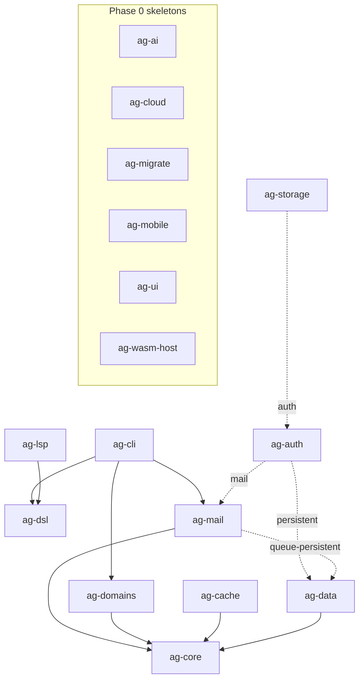

# Pre-Phase 5 Architecture & Maintainability Audit (Stage 2)

> Stage 2 deliverable of the master audit plan. Verifies that Anti-Gravital is
> not only working but well-designed to grow: clear crate responsibilities, no
> cycles, `ag-core` independent of high-level modules, optional cross-crate
> coupling, and feature flags that do not inflate binaries.

- **Date:** 2026-05-29
- **Branch:** `audit-pre-fase5`
- **Method:** static read of every `crates/*/Cargo.toml`; `cargo tree`
  (`--workspace`, `--duplicates`, per-crate feature trees).

## Crate map (internal dependency graph)

Required edge = solid; optional (Cargo feature) edge = dashed.

`ag-realtime` and `ag-observe` have no internal `ag-*` dependencies (they sit on
external crates only). The six skeletons have no dependencies.

## Dependency-rule compliance (CLAUDE.md §15)

| Rule | Status | Evidence |
| --- | --- | --- |
| `ag-core` depends on no Anti-Gravital crate | **pass** | `cargo tree -p ag-core --no-default-features` shows zero `ag-*` edges |
| No dependency cycles | **pass** | normal graph is a DAG (see below); no dev-dependency cycle either |
| `ag-mail` does NOT depend on `ag-auth` (rule 6) | **pass** | `ag-mail` deps = `ag-core` + optional `ag-data`; only the reverse edge `ag-auth -> ag-mail` exists |
| `ag-domains` consumed optionally by higher layers (rule 7) | **pass** | `ag-domains` deps = `ag-core`; consumed by `ag-cli` |
| Cross-crate coupling behind features | **pass** | `ag-data`/`ag-mail`/`ag-auth` cross-edges are all `optional = true` |

### Cycle analysis
Topological order (a valid linearization proves the DAG): `ag-core`, `ag-dsl` →
`ag-data`, `ag-cache`, `ag-domains` → `ag-mail` → `ag-auth` → `ag-storage`;
`ag-lsp` and `ag-cli` are sinks. `ag-auth` dev-depends on `ag-mail` and `ag-mail`
is dev-depended-on by `ag-auth` only in one direction — no dev cycle.

## Crate responsibilities

Each functional crate maps 1:1 to a CLAUDE.md §14 responsibility, with a single
clear concern:

- **ag-core** — HTTP runtime, Shield pipeline, typed extractors. Base layer.
- **ag-dsl** — schema language: lexer/parser/AST/semantics/codegen. Base layer.
- **ag-cli** — `ag` binary; orchestrates DSL, domains, mail.
- **ag-auth** — authn/z primitives (JWT, WebAuthn, OAuth2, API keys).
- **ag-data** — PostgreSQL pool + migrations.
- **ag-realtime** — WebSocket/SSE/pub-sub + optional NATS.
- **ag-cache** — L1 cache + optional native RESP2 server.
- **ag-storage** — object store (native FS / S3) + signed URLs + image proc.
- **ag-observe** — tracing/OTLP/Prometheus.
- **ag-mail** — transactional outbound mail (SMTP + adapters).
- **ag-domains** — DNS provider trait + ACME + SPF/DKIM/DMARC.
- **ag-lsp** — language server for the DSL.

No crate exhibits scope bleed (e.g. `ag-mail` is outbound-only, not an MTA;
`ag-domains` is not a registrar; `ag-cache` L2 is in-process, not a Redis
re-implementation).

## Feature-flag hygiene

Defaults keep external/vendor dependencies out unless explicitly requested,
satisfying ADR-0009 rule 2 (native default, external never mandatory):

| Crate | Default | Opt-in (pulls external dep) |
| --- | --- | --- |
| ag-core | validation, cors, csrf, logging, rate-limit, auth-jwt, tls | (granular toggles only) |
| ag-storage | native FS | `s3` (object_store), `auth` (ag-auth) |
| ag-cache | L1 (moka) | `native-server` (dashmap) |
| ag-realtime | in-process bus | `nats-external` (async-nats), `event-persistence` |
| ag-mail | smtp, templates, metrics | `resend`/`ses`/`postmark` (reqwest), `queue-persistent` (ag-data) |
| ag-domains | acme, propagation (protocol clients) | `cloudflare` (reqwest) |
| ag-auth | none | `persistent` (ag-data), `mail` (ag-mail) |

Note: `ag-mail` default includes `smtp` (lettre) and `ag-domains` default
includes `acme`/`propagation` (instant-acme, hickory-resolver). These are
*protocol clients*, not vendor SDKs, so they are not vendor lock-in; the vendor
*adapters* (Cloudflare, Resend, SES, Postmark, S3) are all opt-in. This is
consistent with the rule.

## Findings

| ID | Severity | Finding |
| --- | --- | --- |
| S2-1 | Low | Duplicate transitive versions present (`axum` 0.7/0.8, `dashmap` 5/6, `getrandom` 0.2/0.3/0.4, `hashbrown` 0.14/0.15/0.17, `matchit`, `nom`, `itertools`, windows target crates). All transitive, `cargo deny` `multiple-versions = "warn"`. Not blocking; binary impact is small (mostly platform-gated). Recommend revisiting when upstreams converge. |
| S2-2 | Low | `ag-cli` depends on `ag-dsl`, `ag-domains`, `ag-mail` as required (non-optional). Reasonable for a unified CLI (`ag mail test`, `ag domains check`), but means the `ag` binary always links mail/domains. Acceptable; documented for awareness. |

No coupling, cycle, or layering violation was found. No refactor is required for
Phase 5 readiness.

## Changes applied

None. The architecture passes as-is. (The only architecture-adjacent fix in this
audit was Stage 1's `ag-realtime` `thiserror` dependency declaration, which
restored honest feature-gated builds.)

## Acceptance criteria status (Stage 2)

Document includes: crate map, internal dependencies, external dependencies
(features table), coupling risks, features per crate, refactor recommendations
(none required), and applied changes (none) — satisfying the Stage 2 criteria.
Gate row **API/DX** depends additionally on the Stage 2.2 ergonomics review,
tracked toward the final gate.
