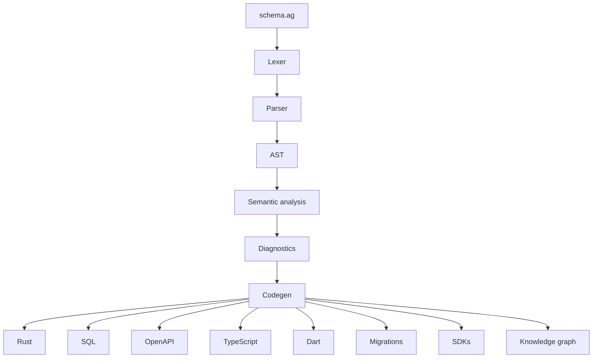

# DSL compilation pipeline

The Anti-DSL compiler stages and codegen targets (CLAUDE.md rule 20). The
`schema.ag` source flows through the `ag-dsl` crate; codegen emits the
artifacts that the rest of the ecosystem consumes.

The diagnostics stage gates codegen: a schema with errors produces typed
diagnostics and no output. Codegen targets land incrementally across DSL
versions per the roadmap.
