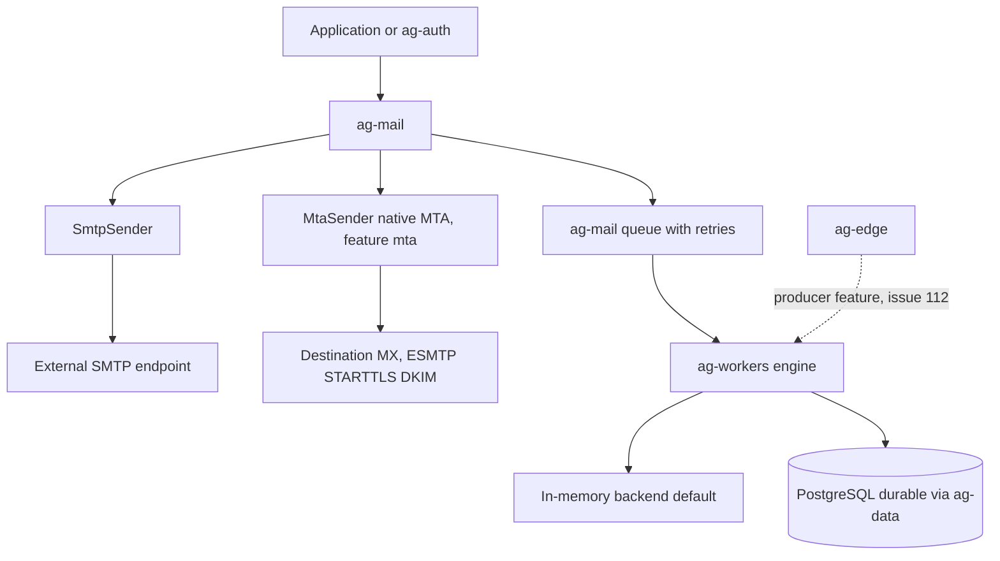

# Mail and workers data flow

How outbound email and background jobs move through `ag-mail` and
`ag-workers`. `ag-mail` sends either through the native `SmtpSender`
(external SMTP endpoint) or the native `MtaSender` (direct MX delivery,
feature `mta`). Durable job execution flows into `ag-workers`, whose
default backend is in-memory and whose durable backend is PostgreSQL via
`ag-data`.

`ag-auth` consumes `ag-mail` for verification, recovery and magic-link
emails; `ag-mail` never depends on `ag-auth`. There are no brand-named mail
adapters (ADR-0011): external providers are reached by pointing `SmtpSender`
at their SMTP endpoint.
