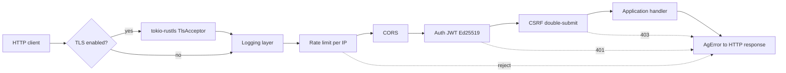

# Request flow through the Shield pipeline

How an HTTP request traverses the `ag-core` Shield before reaching the
application handler. Layer order is outermost-to-innermost: logging,
rate-limit, CORS, auth-JWT, CSRF (see `docs/manual/01-shield-as-library.md`
section 1.5 and RFC-0002).

Rate-limit runs before cryptographic validation so an abusive client is
rejected before spending CPU. CSRF runs after auth, so an attacker without a
valid token never reaches the CSRF cycle.
