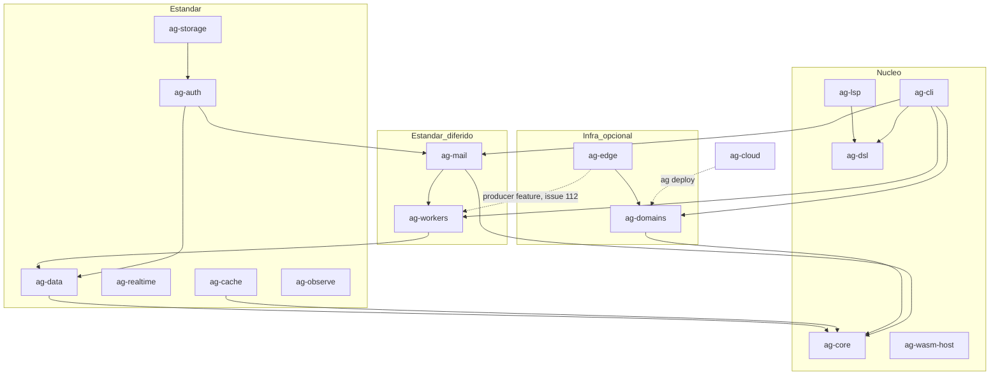

# Workspace dependency diagram

Inter-crate dependency edges between Anti-Gravital crates, derived from the
Cargo manifests (`crates/*/Cargo.toml`). Solid arrows are direct Cargo
dependencies; dotted arrows are feature-gated or deferred relationships.
Source of truth: CLAUDE.md sections 14-15 and the manifests.

Invariants enforced by these edges (CLAUDE.md rule 15):

- `ag-core` depends on no other Anti-Gravital crate.
- No cycles.
- `ag-mail` does not depend on `ag-auth` (the reverse holds).
- `ag-workers` does not depend on `ag-edge`; the only allowed direction is
  `ag-edge -> ag-workers` behind the `producer` feature (issue #112).
